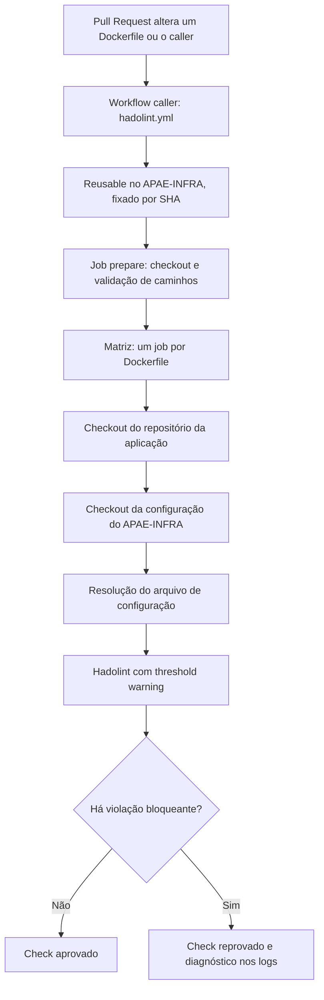

# Workflow reutilizável de lint de Dockerfiles com Hadolint

> **Repositório mantenedor:** [`IFPBEsp/APAE-INFRA`](https://github.com/IFPBEsp/APAE-INFRA)  
> **Arquivo do workflow:** [`.github/workflows/hadolint-reusable.yml`](https://github.com/IFPBEsp/APAE-INFRA/blob/dev/.github/workflows/hadolint-reusable.yml)  
> **Configuração padrão:** [`.hadolint.yaml`](https://github.com/IFPBEsp/APAE-INFRA/blob/dev/.hadolint.yaml)  
> **Issue de origem:** [APAE-INFRA #70](https://github.com/IFPBEsp/APAE-INFRA/issues/70)  
> **Versão validada nos callers:** `f7d59d6e4ad15d8d199aebf619b5b401ffbcc2f1`  
> **Observação:** os links para `dev` passam a funcionar para esses arquivos depois do merge da implementação. Até lá, consulte o commit indicado.

## 1. Objetivo

O workflow **Reusable Dockerfile Lint** centraliza a análise estática de Dockerfiles utilizados pelos produtos da APAE. Sua finalidade é identificar antecipadamente problemas de boas práticas, portabilidade, segurança e manutenção nas instruções Docker, durante a revisão de Pull Requests (PRs).

A análise é executada pelo [Hadolint](https://github.com/hadolint/hadolint), que interpreta Dockerfiles e incorpora verificações do ShellCheck para instruções de shell, quando aplicável. O workflow é hospedado no `APAE-INFRA` e chamado pelos repositórios de aplicação por meio de `workflow_call`.

### Benefícios

- **Padronização:** todos os produtos consomem a mesma configuração de lint.
- **Reutilização:** cada aplicação mantém somente um pequeno workflow *caller*.
- **Rastreabilidade:** a referência ao reusable é fixada por SHA completo de commit.
- **Feedback no PR:** violações são exibidas nos logs e podem gerar anotações do GitHub Actions associadas ao Dockerfile.
- **Isolamento:** cada Dockerfile é analisado em um job próprio, com matriz e `fail-fast: false`.
- **Privilégio mínimo:** a permissão declarada é `contents: read`; não são exigidos segredos de aplicações.

**Escopo:** lint estático de Dockerfiles. Este workflow **não** faz `docker build`, não executa testes da aplicação, não analisa imagens geradas por vulnerabilidades, não publica imagens e não realiza deploy.

## 2. Organização dos arquivos

No `APAE-INFRA`:

```text
APAE-INFRA/
├── .github/
│   └── workflows/
│       └── hadolint-reusable.yml
├── .hadolint.yaml
└── docs/
    └── workflows/
        └── reusable-hadolint.md
```

Nos repositórios consumidores (*callers*):

```text
REPOSITORIO-DA-APLICACAO/
└── .github/
    └── workflows/
        └── hadolint.yml
```

O caller não precisa copiar `.hadolint.yaml`: por padrão, o reusable faz checkout da configuração pertencente ao mesmo commit do `APAE-INFRA` usado para executar o workflow.

## 3. Arquitetura e sequência de execução



### 3.1. Job `prepare`

O job `prepare` utiliza `ubuntu-latest`, tem timeout de **5 minutos** e realiza as seguintes operações:

1. Faz checkout do repositório chamador (*caller*).
2. Recebe `dockerfiles` como texto com um caminho relativo por linha.
3. Remove linhas vazias, normaliza os caminhos e elimina duplicatas.
4. Rejeita caminhos absolutos, caminhos contendo `..`, arquivos ausentes e caminhos que resolvam para fora do workspace (inclusive por links simbólicos).
5. Valida o valor de `failure-threshold`.
6. Disponibiliza um array JSON de caminhos como output para a matriz do job `lint`.

Se nenhum caminho válido for informado, o job falha com mensagem de erro explícita. A lista precisa apontar para **arquivos presentes no checkout do repositório chamador**.

### 3.2. Job `lint`

O job `lint` depende de `prepare`, tem timeout de **10 minutos por job** e utiliza uma estratégia de matriz:

```yaml
strategy:
  fail-fast: false
  matrix:
    dockerfile: ${{ fromJSON(needs.prepare.outputs.dockerfiles) }}
```

Isso significa que:

- Cada Dockerfile recebe uma execução de lint individual.
- Uma violação em um arquivo não cancela automaticamente a análise dos demais.
- O resultado geral depende dos jobs resultantes da matriz.

Cada job faz checkout da aplicação, recupera a configuração compartilhada, resolve o caminho da configuração e executa `hadolint/hadolint-action`.

### 3.3. Por que o checkout da configuração usa `job.workflow_sha`?

A configuração deve ser compatível com a revisão exata do reusable utilizada pelo caller. O checkout é definido assim:

```yaml
- name: Checkout shared configuration
  if: inputs.config-file == ''
  uses: actions/checkout@11d5960a326750d5838078e36cf38b85af677262 # v4
  with:
    repository: ${{ job.workflow_repository }}
    ref: ${{ job.workflow_sha }}
    path: .infra-hadolint
    persist-credentials: false
```

- `job.workflow_repository` identifica o repositório do workflow reutilizável.
- `job.workflow_sha` identifica o commit do workflow reutilizável que está sendo executado.
- `path: .infra-hadolint` isola o segundo checkout do código da aplicação.

**Importante durante o desenvolvimento da issue #70:** a implementação pode ser validada na branch de trabalho antes de chegar à `dev`. O caller deve apontar para um SHA já publicado que contenha **o reusable e `.hadolint.yaml`**. O SHA não precisa estar incorporado à branch padrão do `APAE-INFRA`.

## 4. Contrato do `workflow_call`

| Input | Tipo | Obrigatório | Padrão | Comportamento |
|---|---|---|---|---|
| `dockerfiles` | `string` | **Sim** | — | Um caminho de Dockerfile por linha, relativo à raiz do repositório chamador. |
| `failure-threshold` | `string` | Não | `warning` | Severidade mínima que torna a análise bloqueante. |
| `config-file` | `string` | Não | `""` | Caminho relativo para configuração própria no repositório chamador; vazio utiliza a configuração central. |

### 4.1. Input `dockerfiles`

Exemplo:

```yaml
with:
  dockerfiles: |
    api/Dockerfile
    app/Dockerfile
```

Regras relevantes:

- Os caminhos devem existir no commit analisado.
- Use `/`, independentemente do sistema operacional local de desenvolvimento.
- Não use caminhos absolutos como `/tmp/Dockerfile`.
- Não use `../` para sair da raiz do repositório.
- Linhas vazias e caminhos duplicados são ignorados.

### 4.2. Input `failure-threshold`

O reusable valida os valores `error`, `warning`, `info`, `style`, `ignore` e `none`, conforme a implementação atual. A semântica efetiva do threshold é aplicada pelo Hadolint. No uso padronizado dos produtos APAE, utilize:

```yaml
with:
  failure-threshold: warning
```

No padrão `warning`, diagnósticos com severidade **warning** ou **error** fazem o check falhar. Diagnósticos apenas `info` ou `style` não falham por si só.

Para políticas diferentes, mudanças no threshold devem ser discutidas na revisão do PR e alinhadas à política de qualidade da equipe. Evite enfraquecer o threshold para esconder problemas existentes.

### 4.3. Input `config-file` — opção avançada

O contrato prevê uma configuração alternativa pertencente ao repositório chamador:

```yaml
with:
  dockerfiles: |
    Dockerfile
  config-file: .github/hadolint/custom.yaml
```

**Limitação conhecida da versão validada (`f7d59d6...`):** existe uma etapa temporária `Verify shared configuration` que executa, sem condição, `ls -la .infra-hadolint` e `test -f .infra-hadolint/.hadolint.yaml`. Quando `config-file` é preenchido, o checkout compartilhado é pulado, mas essa verificação ainda roda. Assim, **o override por `config-file` não está funcional de ponta a ponta nessa revisão**, a menos que a etapa de verificação seja removida ou condicionada.

Correção recomendada no `APAE-INFRA`:

```yaml
- name: Verify shared configuration
  if: inputs.config-file == ''
  shell: bash
  run: |
    set -euo pipefail
    ls -la .infra-hadolint
    test -f .infra-hadolint/.hadolint.yaml
```

Também é aceitável retirar integralmente a etapa temporária, pois `Resolve Hadolint configuration` já verifica a existência do arquivo selecionado. **Após a correção, um novo commit SHA deverá ser publicado e adotado pelos callers**. O caso `config-file` deve ser testado separadamente antes de ser considerado suportado em produção.

## 5. Configuração central `.hadolint.yaml`

A configuração efetivamente validada na issue #70 foi:

```yaml
failure-threshold: warning

ignored: []

override:
  error:
    - DL3002
    - DL3006
    - DL3007
```

### 5.1. Significado

- `failure-threshold: warning`: severidade mínima padrão para bloquear.
- `ignored: []`: nenhuma regra foi globalmente suprimida nessa lista.
- `override.error`: **eleva as regras listadas à severidade `error`**; não as ignora.

| Regra | Descrição resumida | Tratamento central |
|---|---|---|
| `DL3002` | Evitar executar a imagem como `root` quando desnecessário. | Elevada para `error`. |
| `DL3006` | Evitar imagem-base sem tag ou digest explícito. | Elevada para `error`. |
| `DL3007` | Evitar imagem-base com tag `latest`. | Elevada para `error`. |

As regras visam incentivar imagens com identidade de versão clara e execução com menor privilégio. Fixar imagens-base por digest fornece maior reprodutibilidade do que depender apenas de tags mutáveis.

### 5.2. Políticas de exceção

Não adicione uma regra a `ignored` globalmente apenas porque ela passou a falhar em um produto. Prefira:

1. Corrigir a causa no Dockerfile.
2. Documentar impedimentos técnicos reais.
3. Em casos excepcionais, aplicar uma supressão pontual na instrução, com justificativa clara, conforme a sintaxe suportada pelo Hadolint.
4. Solicitar revisão da exceção pelo responsável pelo padrão de Dockerfiles.

Exemplo ilustrativo de supressão pontual (somente quando tecnicamente justificada):

```dockerfile
# Justificativa: pacote é gerado em repositório interno sem versão estável acessível.
# hadolint ignore=DL3008
RUN apt-get update && apt-get install -y --no-install-recommends pacote-interno \
    && rm -rf /var/lib/apt/lists/*
```

**Atenção:** comentários de justificativa são documentação para revisores; o Hadolint não interpreta a justificativa como mecanismo de autorização. Supressões devem ser específicas e revisadas.

## 6. Como integrar um novo repositório

### 6.1. Pré-requisitos

- Repositório hospedado no GitHub com GitHub Actions habilitado.
- Dockerfiles já versionados e caminhos conhecidos.
- Acesso de leitura ao reusable do `APAE-INFRA` (atualmente público).
- SHA completo de um commit existente contendo os arquivos do reusable e da configuração.
- Permissões mínimas `contents: read`.

### 6.2. Criar o caller

Crie `.github/workflows/hadolint.yml`:

```yaml
name: Dockerfile Lint

on:
  pull_request:
    paths:
      - "api/Dockerfile"
      - "app/Dockerfile"
      - ".github/workflows/hadolint.yml"

permissions:
  contents: read

jobs:
  hadolint:
    name: Lint Dockerfiles
    uses: IFPBEsp/APAE-INFRA/.github/workflows/hadolint-reusable.yml@f7d59d6e4ad15d8d199aebf619b5b401ffbcc2f1
    with:
      dockerfiles: |
        api/Dockerfile
        app/Dockerfile
      failure-threshold: warning
```

**Adapte os caminhos** ao repositório consumidor. A entrada `uses:` é de nível de job, não de `steps`, porque o destino é um *reusable workflow* e não uma action convencional.

### 6.3. Por que usar `pull_request.paths`?

O gatilho executa o workflow quando o PR altera pelo menos um dos Dockerfiles monitorados ou o próprio caller. Isso evita execuções desnecessárias para mudanças não relacionadas.

A lista `paths` é usada **somente para disparar** o workflow. Quando disparado, o reusable verifica **todos** os Dockerfiles informados em `with.dockerfiles`, mesmo que o PR tenha modificado apenas um deles.

> **Atenção:** workflows filtrados por `paths` podem deixar checks obrigatórios em estado pendente quando as alterações do PR não correspondem ao filtro. Antes de tornar o job um *required status check* global na proteção de branch, avalie essa interação e defina uma estratégia de gatilhos coerente com a política do repositório.

### 6.4. Criar PR e validar

1. Crie uma branch a partir da branch de destino do produto.
2. Commit o arquivo `.github/workflows/hadolint.yml`.
3. Abra um PR contra a branch de destino correta.
4. Inspecione o workflow **Dockerfile Lint** em *Actions* ou em *Checks* no PR.
5. Verifique `Prepare Dockerfiles` e um job `Hadolint (...)` por Dockerfile.
6. Caso haja findings, corrija os Dockerfiles ou registre uma justificativa técnica para exceção pontual.
7. Registre o link da execução bem-sucedida no PR e, se pertinente, na issue central.

O próprio caller consta no filtro `paths`; portanto, sua inclusão no PR já deve permitir a validação inicial.

## 7. Callers implantados nos projetos APAE

Todos os callers desta seção utilizam o reusable do `APAE-INFRA` fixado no commit:

```text
f7d59d6e4ad15d8d199aebf619b5b401ffbcc2f1
```

### 7.1. APAE Geral

Repositório: [`IFPBEsp/APAE`](https://github.com/IFPBEsp/APAE)  
PR: [#1050](https://github.com/IFPBEsp/APAE/pull/1050)

```yaml
name: Dockerfile Lint

on:
  pull_request:
    paths:
      - "apps/api/Dockerfile"
      - "apps/apae/Dockerfile"
      - ".github/workflows/hadolint.yml"

permissions:
  contents: read

jobs:
  hadolint:
    name: Lint Dockerfiles
    uses: IFPBEsp/APAE-INFRA/.github/workflows/hadolint-reusable.yml@f7d59d6e4ad15d8d199aebf619b5b401ffbcc2f1
    with:
      dockerfiles: |
        apps/api/Dockerfile
        apps/apae/Dockerfile
      failure-threshold: warning
```

Validação: [Dockerfile Lint — execução #38009826734](https://github.com/IFPBEsp/APAE/actions/runs/38009826734). Passaram `Prepare Dockerfiles` e os dois jobs de Hadolint.

### 7.2. APAE Atendimento

Repositório: [`IFPBEsp/APAE-atendimento`](https://github.com/IFPBEsp/APAE-atendimento)  
PR: [#446](https://github.com/IFPBEsp/APAE-atendimento/pull/446)

```yaml
name: Dockerfile Lint

on:
  pull_request:
    paths:
      - "backend/atendimento/Dockerfile"
      - "frontend/atendimento-app/Dockerfile"
      - ".github/workflows/hadolint.yml"

permissions:
  contents: read

jobs:
  hadolint:
    name: Lint Dockerfiles
    uses: IFPBEsp/APAE-INFRA/.github/workflows/hadolint-reusable.yml@f7d59d6e4ad15d8d199aebf619b5b401ffbcc2f1
    with:
      dockerfiles: |
        backend/atendimento/Dockerfile
        frontend/atendimento-app/Dockerfile
      failure-threshold: warning
```

Validação: [Dockerfile Lint — execução #38011770413](https://github.com/IFPBEsp/APAE-atendimento/actions/runs/38011770413). Passaram `Prepare Dockerfiles` e os dois jobs de Hadolint. **A pipeline geral `CI Pipeline` registrou falha separada no mesmo commit**; não confundir essa falha com o resultado do Hadolint.

### 7.3. APAE Gestão Escolar

Repositório: [`IFPBEsp/APAE-gestao-escolar`](https://github.com/IFPBEsp/APAE-gestao-escolar)  
PR: [#459](https://github.com/IFPBEsp/APAE-gestao-escolar/pull/459)

```yaml
name: Dockerfile Lint

on:
  pull_request:
    paths:
      - "api/Dockerfile"
      - "app/Dockerfile"
      - ".github/workflows/hadolint.yml"

permissions:
  contents: read

jobs:
  hadolint:
    name: Lint Dockerfiles
    uses: IFPBEsp/APAE-INFRA/.github/workflows/hadolint-reusable.yml@f7d59d6e4ad15d8d199aebf619b5b401ffbcc2f1
    with:
      dockerfiles: |
        api/Dockerfile
        app/Dockerfile
      failure-threshold: warning
```

Validação: [Dockerfile Lint — execução #38012687230](https://github.com/IFPBEsp/APAE-gestao-escolar/actions/runs/38012687230). Passaram `Prepare Dockerfiles` e os dois jobs de Hadolint.

### 7.4. APAE Site Comemorativo

Repositório: [`IFPBEsp/apae-site-comemorativo`](https://github.com/IFPBEsp/apae-site-comemorativo)  
PR: [#63](https://github.com/IFPBEsp/apae-site-comemorativo/pull/63)

```yaml
name: Dockerfile Lint

on:
  pull_request:
    paths:
      - "Dockerfile"
      - ".github/workflows/hadolint.yml"

permissions:
  contents: read

jobs:
  hadolint:
    name: Lint Dockerfile
    uses: IFPBEsp/APAE-INFRA/.github/workflows/hadolint-reusable.yml@f7d59d6e4ad15d8d199aebf619b5b401ffbcc2f1
    with:
      dockerfiles: |
        Dockerfile
      failure-threshold: warning
```

A validação inicial ([execução #38013140792](https://github.com/IFPBEsp/apae-site-comemorativo/actions/runs/38013140792)) identificou:

- **DL3008 — warning:** pacotes instalados via `apt-get install` sem versões fixadas.
- **DL3015 — info:** ausência de `--no-install-recommends`.

A correção realizada no Dockerfile adicionou `--no-install-recommends` e versões explícitas aos pacotes `openssl`, `python3`, `make` e `g++`. Na validação posterior, [execução #38013619380](https://github.com/IFPBEsp/apae-site-comemorativo/actions/runs/38013619380), `Prepare Dockerfiles` e `Hadolint (Dockerfile)` passaram.

**Observação:** a execução bem-sucedida de Hadolint não é evidência suficiente de que o build da imagem tenha sido executado ou aprovado.

## 8. Evidências consolidadas da issue #70

| Produto | PR de integração | Dockerfiles verificados | Execução Hadolint | Resultado |
|---|---|---:|---|---|
| APAE Geral | [#1050](https://github.com/IFPBEsp/APAE/pull/1050) | 2 | [#38009826734](https://github.com/IFPBEsp/APAE/actions/runs/38009826734) | **Success** |
| APAE Atendimento | [#446](https://github.com/IFPBEsp/APAE-atendimento/pull/446) | 2 | [#38011770413](https://github.com/IFPBEsp/APAE-atendimento/actions/runs/38011770413) | **Success** |
| APAE Gestão Escolar | [#459](https://github.com/IFPBEsp/APAE-gestao-escolar/pull/459) | 2 | [#38012687230](https://github.com/IFPBEsp/APAE-gestao-escolar/actions/runs/38012687230) | **Success** |
| APAE Site Comemorativo | [#63](https://github.com/IFPBEsp/apae-site-comemorativo/pull/63) | 1 | [#38013619380](https://github.com/IFPBEsp/apae-site-comemorativo/actions/runs/38013619380) | **Success** |
| **Total** | **4 repositórios** | **7** | **4 execuções aprovadas** | **Hadolint validado** |

As evidências comprovam a execução do reusable e o processamento dos sete Dockerfiles nos quatro repositórios. A primeira falha do Site Comemorativo também demonstrou o bloqueio por regra `warning` (`DL3008`).

## 9. Interpretando diagnósticos e corrigindo Dockerfiles

### 9.1. `DL3008`: fixar versões em `apt-get install`

Exemplo que produz diagnóstico:

```dockerfile
RUN apt-get update && apt-get install -y curl
```

Exemplo de correção (substituir pela versão efetivamente disponível na distribuição utilizada):

```dockerfile
RUN apt-get update \
    && apt-get install -y --no-install-recommends \
       curl=<VERSAO_COMPATIVEL> \
    && rm -rf /var/lib/apt/lists/*
```

**As versões precisam ser verificadas para a distribuição, arquitetura e repositórios APT da imagem-base.** O Hadolint verifica a prática de fixar versões, mas não assegura que uma versão específica esteja disponível. É necessário executar um build Docker separadamente.

### 9.2. `DL3015`: evitar dependências recomendadas desnecessárias

Inclua `--no-install-recommends` ao instalar pacotes APT, reduzindo dependências adicionais e o tamanho potencial da imagem:

```dockerfile
RUN apt-get update \
    && apt-get install -y --no-install-recommends \
       ca-certificates=<VERSAO_COMPATIVEL> \
    && rm -rf /var/lib/apt/lists/*
```

### 9.3. Resultado de severidades

Com `failure-threshold: warning`:

- **Error:** bloqueia o check.
- **Warning:** bloqueia o check.
- **Info:** é informativo, mas não bloqueia isoladamente.
- **Style:** é informativo, mas não bloqueia isoladamente.

Não confunda o texto de diagnóstico nos logs com a política de bloqueio. Alguns formatos de saída ou ações podem emitir registros de anotação com prefixos próprios; o critério efetivo é a severidade configurada e o exit code do Hadolint.

## 10. Solução de problemas (*troubleshooting*)

### 10.1. `Configuracao nao encontrada: .infra-hadolint/.hadolint.yaml`

**Sintoma:** o job `Resolve Hadolint configuration` falha.

**Causas mais prováveis:**

- O commit referenciado pelo caller não contém `.hadolint.yaml`.
- O checkout da configuração usa a referência incorreta ou a branch padrão.
- O arquivo foi criado localmente, mas não commitado/publicado no remoto.

**Procedimento:**

1. Copie o SHA completo da linha `uses:` do caller.
2. Abra no GitHub o `.hadolint.yaml` exatamente nesse commit do `APAE-INFRA`.
3. Confirme `repository: ${{ job.workflow_repository }}` e `ref: ${{ job.workflow_sha }}`.
4. Verifique os logs de `Checkout shared configuration` e `Verify shared configuration`.
5. Se houve novo commit no reusable, atualize a referência SHA de todos os callers relevantes.

### 10.2. Workflow não inicia nenhum job

**Sintoma:** o GitHub registra uma execução falha do workflow, sem jobs.

**Causa real observada no Atendimento:** a referência `uses:` continha um SHA inválido com **41 caracteres** devido a um caractere extra ao final.

Exemplo correto:

```yaml
uses: IFPBEsp/APAE-INFRA/.github/workflows/hadolint-reusable.yml@f7d59d6e4ad15d8d199aebf619b5b401ffbcc2f1
```

Verifique também a existência do arquivo `hadolint-reusable.yml` no commit indicado e se o workflow contém `on.workflow_call`. Em caso de falha de validação do YAML, consulte as mensagens de erro do GitHub no PR ou na página de execução.

### 10.3. O workflow não é disparado para certos PRs

Confira o filtro `pull_request.paths` do caller. Ele executa apenas quando pelo menos um caminho listado é modificado. O arquivo `.github/workflows/hadolint.yml` deve estar incluído na lista para permitir o teste da própria integração.

### 10.4. `Dockerfile nao encontrado`

O job `prepare` não conseguiu localizar o arquivo indicado. Confira a grafia exata, letras maiúsculas/minúsculas e a posição no repositório. Caminhos são relativos à raiz do checkout da aplicação.

### 10.5. Falha específica de regra Hadolint

Examine o job `Hadolint (<arquivo>)`, identifique o código da regra (`DL...` ou `SC...`) e a linha. Corrija o Dockerfile e faça novo push no PR. Evite alterar `.hadolint.yaml` globalmente para resolver um problema específico de um projeto.

### 10.6. `config-file` alternativo falha antes do lint

Na revisão `f7d59d6...`, a etapa temporária `Verify shared configuration` é incondicional. Consulte a [seção 4.3](#43-input-config-file--opção-avançada) e condicione ou remova essa etapa no reusable, com teste específico e atualização posterior do SHA dos callers.

### 10.7. `fatal: No url found for submodule path ... in .gitmodules`

Esse erro pode ser emitido por `actions/checkout` quando o repositório chamador contém um gitlink de submódulo (`mode 160000`) sem entrada correspondente em `.gitmodules`.

Diagnóstico:

```bash
git ls-files --stage | grep '^160000'
```

Se o submódulo foi criado por acidente, pode-se remover apenas sua referência do índice com `git rm --cached CAMINHO`, após confirmar que não é utilizado intencionalmente. Se for legítimo, regularize seu cadastro em `.gitmodules`.

### 10.8. Hadolint aprova, mas `docker build` falha

Os objetivos são diferentes. O Hadolint valida a forma das instruções; o build verifica se elas são executáveis com as dependências, versões, arquitetura e rede reais. Execute um build separado, especialmente após fixar versões de pacotes APT ou alterar a imagem-base.

## 11. Segurança e governança

### 11.1. Permissões

O workflow declara:

```yaml
permissions:
  contents: read
```

A análise não precisa de permissões de escrita para issues, pull requests, packages ou deployments. Os checkouts usam `persist-credentials: false`, evitando manter as credenciais Git no checkout após a etapa.

### 11.2. Pinagem por SHA

- `actions/checkout` está fixado no commit `11d5960a326750d5838078e36cf38b85af677262` (versão comentada: v4).
- `hadolint/hadolint-action` está fixado no commit `54c9adbab1582c2ef04b2016b760714a4bfde3cf` (versão comentada: v3.1.0).
- Os callers de aplicação usam o SHA completo do commit do reusable no `APAE-INFRA`.

A pinagem evita que alterações futuras numa tag ou branch modifiquem silenciosamente o comportamento do CI. Para atualizar componentes, abra PR, teste o novo SHA e faça a alteração de forma auditável.

### 11.3. Configuração e alterações centralizadas

Mudanças em `.hadolint.yaml` ou no reusable podem impactar todos os produtos, mas **não alteram automaticamente callers já fixados no SHA anterior**. A atualização exige que cada caller passe a referenciar o novo commit.

Fluxo recomendado:

1. Alterar o reusable/configuração em PR do `APAE-INFRA`.
2. Validar a nova revisão em pelo menos um caller piloto.
3. Confirmar o efeito sobre os sete Dockerfiles e a política de severidade.
4. Publicar o commit e atualizar gradualmente o SHA nos quatro callers.
5. Registrar o motivo da atualização, as regras alteradas e evidências.

### 11.4. Segredos e código de terceiros

O workflow não recebe segredos explicitamente e opera em PRs. Mantenha permissões mínimas, evite `pull_request_target` para executar código não confiável e não introduza tokens com escrita por conveniência. Para futuros passos de build ou publicação, use workflows separados e controles apropriados.

## 12. Critérios de aceite e verificações

| Critério | Evidência / situação |
|---|---|
| Reusable disponível por `workflow_call` | Implementado em `.github/workflows/hadolint-reusable.yml`. |
| Hadolint e checkout fixados por SHA | Confirmado na implementação validada. |
| Permissões mínimas | `contents: read`; checkouts sem persistência de credenciais. |
| Configuração central disponível | `.hadolint.yaml` no `APAE-INFRA`, obtida pelo commit do reusable. |
| Um job por Dockerfile | Matriz dinâmica a partir do input `dockerfiles`. |
| Sete Dockerfiles analisados | Quatro execuções de validação, totalizando sete Dockerfiles. |
| Findings e bloqueio por severidade | Demonstrados por `DL3008` no primeiro teste do Site Comemorativo. |
| Documentação dos inputs e adoção | Este documento. |
| Override `config-file` opcional | **Limitação conhecida** nesta revisão, descrita na seção 4.3; necessita ajuste e validação específica. |


## 13. Referências

- [Issue #70 — Hadolint reutilizável](https://github.com/IFPBEsp/APAE-INFRA/issues/70)
- [Hadolint — projeto e documentação](https://github.com/hadolint/hadolint)
- [Hadolint GitHub Action](https://github.com/hadolint/hadolint-action)
- [GitHub Actions — reutilização de workflows](https://docs.github.com/en/actions/how-tos/sharing-automations/reusing-workflows)
- [GitHub Actions — contextos](https://docs.github.com/en/actions/reference/workflows-and-actions/contexts)
- [GitHub Actions — sintaxe de workflows](https://docs.github.com/en/actions/reference/workflows-and-actions/workflow-syntax)
- [Boas práticas de Docker do APAE-INFRA](https://github.com/IFPBEsp/APAE-INFRA/blob/dev/docs/boas-praticas/04-docker.md)

---

**Manutenção:** este documento deve ser revisado sempre que houver alteração no contrato `workflow_call`, na política `.hadolint.yaml`, nas versões das actions ou nos caminhos dos Dockerfiles dos produtos.
